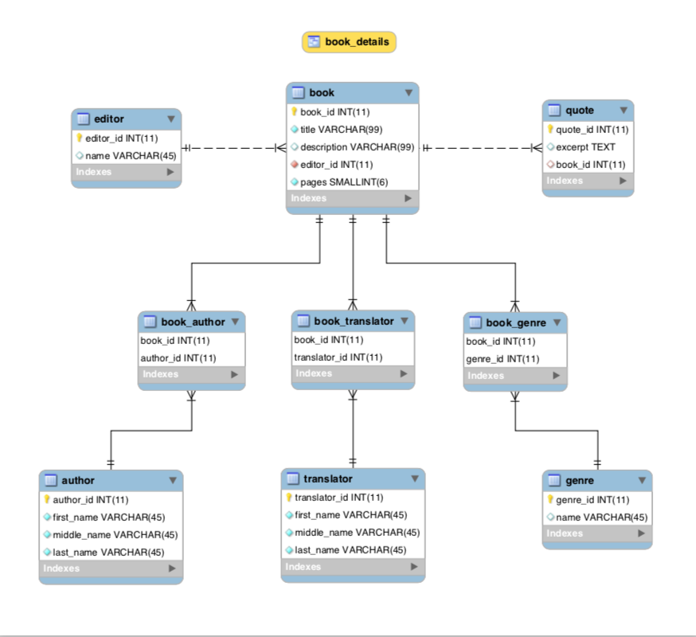

## My Library

This repo holds a mysql database representing the (physical) books of my home library.  
I began working on it as an incentive to develop my sql skills, but also because I actually wanted to run various queries against my books.

The first db schema was as simple as it gets, a single table holding general data about each book.
```
mysql> select * from book;
+---------+------------------+----------+-------+---------------+--------+------------+
| book_id | author           | title    | genre | description   | editor | translator |
+---------+------------------+----------+-------+---------------+--------+------------+
|       1 | Emmanouel Roides | Apanta A | Prose | Complete Opus | Hermes | NULL       |
|       2 | Emmanouel Roides | Apanta B | Prose | Complete Opus | Hermes | NULL       |
|       3 | Emmanouel Roides | Apanta C | Prose | Complete Opus | Hermes | NULL       |
|       4 | Emmanouel Roides | Apanta D | Prose | Complete Opus | Hermes | NULL       |
|       5 | Emmanouel Roides | Apanta E | Prose | Complete Opus | Hermes | NULL       |
+---------+------------------+----------+-------+---------------+--------+------------+
```
This facilitated the (manual and painful) data entry but of course it resulted in a very denormalized db state.  
At some point I decided to start migrating the schema by utilizing the relations of the `book` columns.  
This process allowed me to enjoy some DDL and DML practice and ended up in the following schema.



In order to emulate the readable table of the original flat schema I created the following view:
```sql
CREATE VIEW book_details AS

-- A couple of inline views in order to have a more readable author/translator name
WITH author_full_name AS (
    SELECT
        author_id,
        CONCAT_WS(' ', first_name, NULLIF(middle_name,''), NULLIF(last_name,'')) AS full_name
    FROM
        author
),
translator_full_name AS (
    SELECT
        translator_id,
        CONCAT_WS(' ', first_name, NULLIF(middle_name,''), NULLIF(last_name,'')) AS full_name
    FROM
        translator
)

SELECT
    -- Group the many to one relationships in one row and one column, with values separated by commas.
    GROUP_CONCAT(DISTINCT a.full_name SEPARATOR ', ') AS author,
    b.title AS title,
    b.description AS description,
    GROUP_CONCAT(DISTINCT g.name SEPARATOR ', ') AS genre,
    GROUP_CONCAT(DISTINCT t.full_name SEPARATOR ', ') AS translator,
    e.name AS editor,
    b.pages
FROM
    book b
    INNER JOIN book_author ba ON b.book_id = ba.book_id
    INNER JOIN author_full_name a ON ba.author_id = a.author_id
    INNER JOIN book_genre bg ON bg.book_id = b.book_id
    INNER JOIN genre g ON g.genre_id = bg.genre_id
    INNER JOIN editor e ON b.editor_id = e.editor_id
    LEFT JOIN book_translator bt ON bt.book_id = b.book_id
    LEFT JOIN translator_full_name t ON t.translator_id = bt.translator_id
GROUP BY
    b.title,
    b.description,
    e.name,
    b.pages;
```

Example result set:
```
mysql> select * from book_details where genre = 'Sailing';
+---------------------+-------------------------------+------------------------------------+---------+------------+------------+-------+
| author              | title                         | description                        | genre   | translator | editor     | pages |
+---------------------+-------------------------------+------------------------------------+---------+------------+------------+-------+
| Andrew Simpson      | Diesel Engine Handbook        | RYA Handbook                       | Sailing |            | RYA        |    92 |
| Panagiotis Strouzas | Istioploia kai Naytiki Techni | Great book, great illustrations    | Sailing |            | HORC       |   558 |
| Tom Cunliffe        | The Complete YachtMaster      | Sailing, Seamanship and Navigation | Sailing |            | Bloomsbury |   310 |
| Tim Bartlett        | VHF Handbook                  | RYA Handbook                       | Sailing |            | RYA        |    98 |
| Georgios Kasimidis  | Weather and the Sea           | Meteorology                        | Sailing |            | Sea Waves  |   226 |
+---------------------+-------------------------------+------------------------------------+---------+------------+------------+-------+
6 rows in set (0.00 sec)
```

I also wanted to keep having an easy way to insert new data so I created the following stored procedure to handle the middle tables etc.
```sql
DELIMITER $

CREATE PROCEDURE InsertBook(
  IN editor_name varchar(45),
  IN author_first_name varchar(45),
  IN author_middle_name varchar(45),
  IN author_last_name varchar(45),
  IN book_title varchar(99),
  IN book_description varchar(99),
  IN book_pages smallint,
  IN genre_name varchar(45),
  IN translator_first_name varchar(45),
  IN translator_middle_name varchar(45),
  IN translator_last_name varchar(45)
)
BEGIN
	-- The unique constraints of each table should disallow duplicates,
	-- hence the INSERT IGNORE, we don't want e.g. an existing editor to cancel the whole operation.
    INSERT IGNORE INTO editor (name) VALUES (editor_name);
    SET @EditorID = (SELECT editor_id FROM editor WHERE name = editor_name);

    INSERT IGNORE INTO author (first_name, middle_name, last_name) VALUES (author_first_name, author_middle_name, author_last_name);
    SET @AuthorID = (SELECT author_id FROM author WHERE first_name = author_first_name AND middle_name = author_middle_name AND last_name = author_last_name);

    INSERT IGNORE INTO book (title, description, editor_id, pages) VALUES (book_title, book_description, @EditorID, book_pages);
    SET @BookID = (SELECT book_id FROM book WHERE title = book_title AND editor_id = @EditorID AND pages = book_pages);

    INSERT IGNORE INTO genre (name) VALUES (genre_name);
    SET @GenreID = (SELECT genre_id FROM genre WHERE name = genre_name);

    INSERT IGNORE INTO translator (first_name, middle_name, last_name) VALUES (translator_first_name, translator_middle_name, translator_last_name);
    SET @TranslatorID = (SELECT translator_id FROM translator WHERE first_name = translator_first_name AND middle_name = translator_middle_name AND last_name = translator_last_name);

    INSERT INTO book_author (book_id, author_id) VALUES (@BookID, @AuthorID);
    INSERT INTO book_translator (book_id, translator_id) VALUES (@BookID, @TranslatorID);
    INSERT INTO book_genre (book_id, genre_id) VALUES (@BookID, @GenreID);
END $

DELIMITER ;

begin;
call InsertBook(
  'Istos',              -- Editor
  'Unknown',            -- Author's first name
  '',                   -- Author's middle name
  '',                   -- Author's last name
  'Gilgamesh',          -- Book title
  'The ancient epic',   -- Book Description
   230,                 -- Book pages
  'Poetry',             -- Genre
  'Aura',               -- Translator's first name
  '',                   -- Translator's middle name
  'Ward'                -- Translator's last name
);
commit;
```

I have a loose plan to decorate this database with a web-app at some point in the future.
Until then feel free to restore the mysqldump file and browse my library.

```
mysql> SOURCE /path/to/my-library_dump.sql
```

---
The mysqldump command used was:
`mysqldump --skip-opt -uroot -p -B my-library > $git-repos/my-library/my-library_dump.sql`
